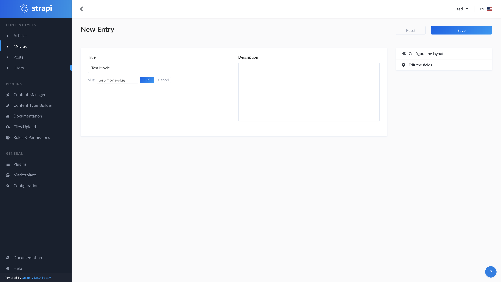

- Start Date: (fill in today's date, YYYY-MM-DD)
- RFC PR: (leave this empty)

# Summary

Adding the slug option to content type so that they can be retrieved by a string key rather than by ID. Good for SEO support for blog like features.

# Motivation

Please reference the issues [here](https://github.com/strapi/strapi/issues/752) for more details on the exact need.

# Detailed design

Below are the screens for the proposed implementation, which we have ready to submit as a PR.

## Content Type

When creating a new content type after setting the basic informations

The user is able to configure the slug by clicking on the `Configure` button.

In the new options configuration screen the user will find an option to pick which property to use for the slug. In the future there are plans to add more options for each content type like draft & archive, ownership and versioning.

Once a content type is saved the user can always access the configuration options by clicking on the `Configure` button

## Instance View Updates

When a slug is configured for a content type when creating an instance of it the user will see the slug entry displayed below the property that was selected.

By clicking the edit buttons the user is able to change the slug

## Changes to API permission

In the API permission there is now an options for findonebyslug which will return an item by it's slug

Sample API response:

# Alternatives

There is one workaround described [here](https://github.com/strapi/strapi/issues/752#issuecomment-447541531) but it is not as flexible as it doesn't allow for slug management in the CMS and in some cases the computed slug could be wrong. For example if the title is "It's a wonderful day" the computed slug would be "its-a-wonderful-day" which is actually bad grammar.

# Known Issues

There is an [knows issues](https://github.com/strapi/strapi/issues/1189) with unique attributes in stripe which we are leveraging for slug uniqueness in the collection so once that is fixed the slug should work as well.
