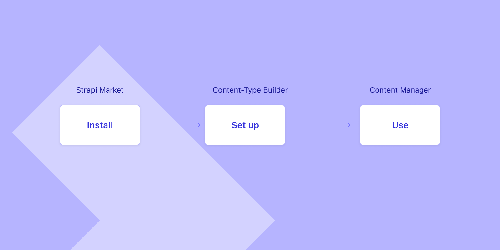
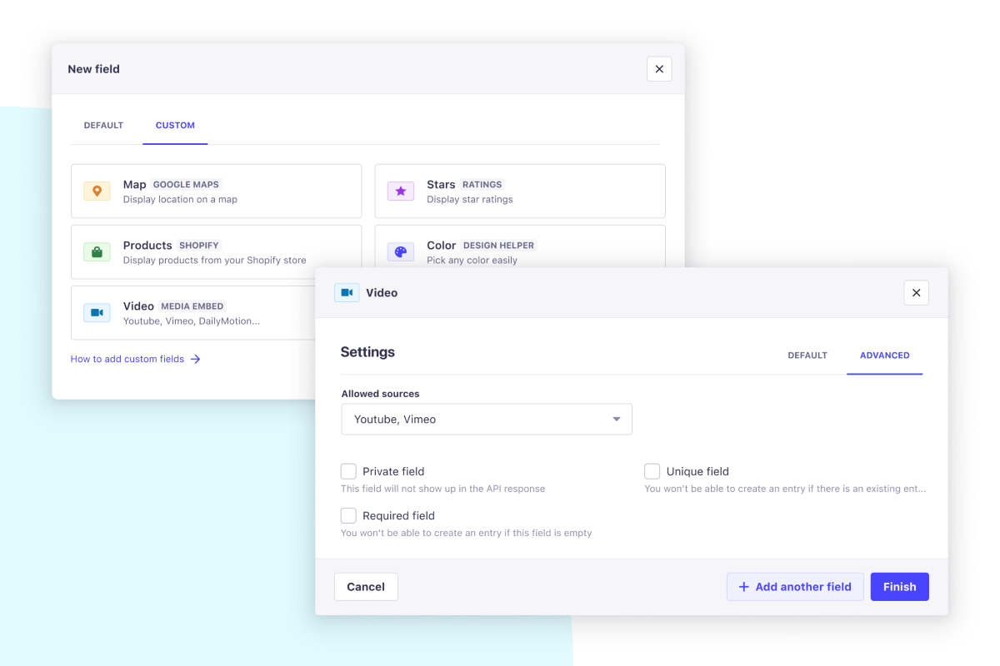
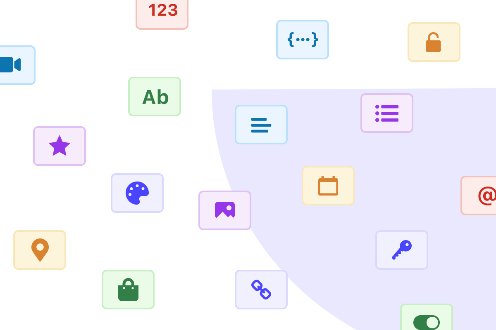
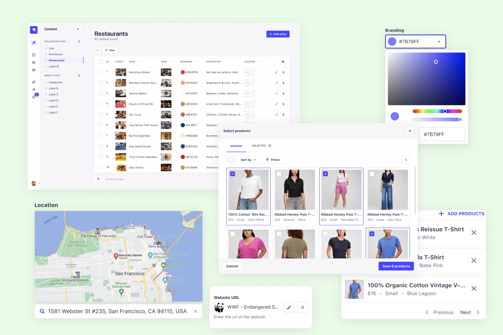

- Start Date: 03-16-2022
- RFC PR: (leave this empty)

_Disclaimer_: This RFC is at an early stage and covers only high-level requirements. We are hoping the community can help us identify and spec the technical requirements. Thank you in advance for your help.

# Summary

Custom fields are a way to extend Strapi’s capabilities. They allow users to add new fields to content types for a better content edition experience (nicer display, enriched data, more actions, etc).

# Examples

Based on all the input we got from the community, we identified a few key use cases we’d like to focus on first:

### Map

A content editor could directly search for a location on a map. Instead of entering latitude and longitude coordinates.

### Videos

Embedding a Youtube video would display a nice preview, which would make it easier to parse the content on a glimpse. Instead of having to click on the link to see what the video is about.

### Color picker

Select any color in any format (HEX, RGB, CMYK) directly in Strapi.

### URL

Fetch the data from a URL to show the favicon of the page, as well as the title. Instead of plain text.

### Ecommerce

A more complex is the one where a field would fetch external data. Products from a BigCommerce store for instance. And directly display them in the Content Manager.

# Motivation

Being and staying the most customizable CMS is our goal. Fields are no exception.

Strapi currently supports 10 fields (excluding the dynamic zones and components). However, the possibilities of field types are endless. To empower the community to solve their use cases, we want to offer full autonomy to the fields needed by enabling new API capabilities on the front-end and back-end sides.

The content edition is at the core of Strapi’s value. Managing entries should be as natural as possible. Sometimes, it doesn’t work as well when you try to shoehorn something that doesn’t feel intuitive. For instance, entering a URL for a video.

At a later stage, we would also like to solve more advanced use cases, or even rethink some fundamental features such as the Components and Dynamic Zones for more customizations.

# Detailed design

Installation steps

There are 3 main areas impacted by this feature:

### 1. Strapi Market & Settings

The first step is for a user to install the field. We are still debating on how custom fields should be installed in Strapi. Via a plugin or through a field package.

In any case, the next step is to configure the field if need be. Entering API keys for Google Maps or Shopify, for instance. 

### 2. Content-Type Builder

Once done, the custom field is available in the “custom” tab of the fields picker modal in the Content-Type Builder.

The configuration flow for a custom field should be the same as the native ones. An injection zone allows custom settings to be added in the “Advanced Settings” tab.

Note: the custom field badge is a combination of color and icon provided in the Design System. 

Since we are not introducing any new field type, the content type schema won’t change in structure. This also means the custom fields have the same options as the native ones (ex: required, unique, etc), as well as some additional validation rules. 

### 3. Content Manager

Once properly set up, the real magic happens in the Content Manager. Instead of seeing the usual text fields, you can now interact with maps, videos, color pickers, etc.

In addition, the list view could support these new fields by displaying the field information in a different format than text. For instance, having a color indicator for the color picker column.

Currently, we still need to find solutions around the search, filtering, and sorting of custom fields. As much as it might not be critical to sort colors, it might be useful to filter the latest 30 product descriptions of all the products cheaper than $100 and in the Collection T-Shirt coming from a Shopify store for instance.

In any case, these actions will be based on the underlying type of the custom field. For instance, if the map field is stored as a String, there will be some limitations.

# Tradeoffs

### Installation package: Plugin vs stand-alone package

As a **Plugin**: would fit perfectly in the current marketplace and review process with minor changes.

As a **Field package**: clearly separates the plugin purpose from the field. However, it could be listed as a dependency on the plugins. It means an Ecommerce plugin could add additional features, collection types and fields.

### Field types

Currently, the plan is to only allow custom fields based on existing types (String, Number, JSON, etc.). However, we are considering adding more field types (ex: GeoJSON) at a later stage to support even more advanced custom fields.

Thank you very much for your reading, we are looking forward to reviewing your PR to make this feature a reality very soon.