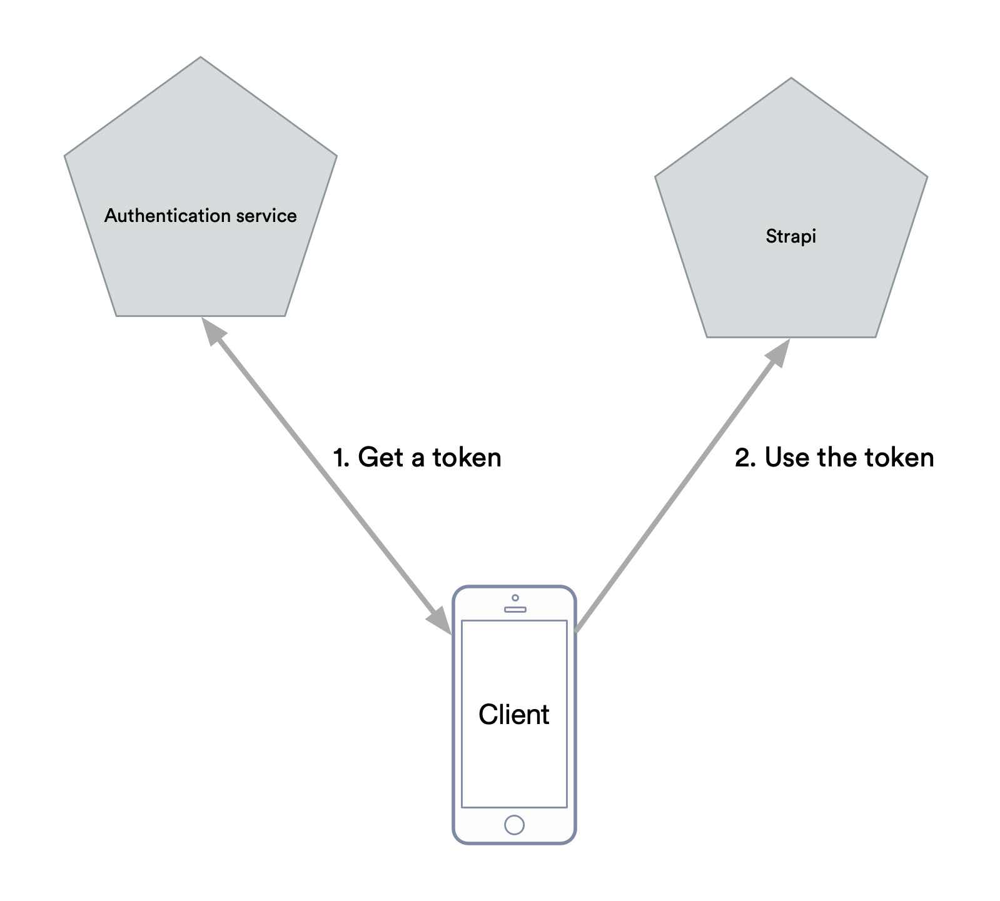

- Start Date: 2019-08-08
- RFC PR: (leave this empty)

# Summary

The proposal is a refactoring of the `users-permissions` plugin in order to make a clear separation between authentication (who is accessing the APIs) and permissions (what can I access). This way it will be possible to strapi to lay on others services for authentication, while keeping it's current way of managing permissions.

# Example

**Use production-ready autentication service**

Whenever we want to use a production-ready, battle tested authentication service that will handle all the providers we need, and hopefully be cerified OpenID Provider, we will be able to create our own plugin for doing user authentication.

# Motivation

Beeing able to customize how strapi authenticate a user calling API, will able us to use products like OAuth0, Keycloak or ory/hydra for example.
Here's how it could work in a top-level perspective :
```
App have an access token emitted by a trusted party, like OAuth0.
App call https://mystrapi/posts with this access token as bearer. 
Strapi introspect the given access token. 
Strapi match the access_token attributes to it's own user model. 
Strapi workflow continue as it is, attributing permissions to the user
```

# Detailed design

My proposal is two splits `users-permissions` plugin in at least two plugins : 

`users-authentication` will : 

1. Implement a middleware on all API's call to match a Bearer to a user model
2. Define controllers for login/registration/lost password. 
3. Expose auth providers callbacks controller
4. Define a user model

`users-permissions` will : 

1. Define permissions model
2. Attach permissions to a user
3. Determine the connected user state (`authenticate`, `public`, `admin`)

The `users-authentication` given by Strapi core would cover the actual use-cases, with login/logout/lost password/auth providers callbacks, and JWT generations on login.

This way, people can develop their own plugin that will disable `users-authentication` and enable their own, like for example a `users-authentication-oauth0` that wouldn't expose any controllers and just match a Bearer to a user model. 

# Tradeoffs

- _Complexity_ : That will simplify the `users-permissions` and let it only the actual permissions logic. So there won't have any tradeoff in complexity.
- _Work load of implementation_ : The implementation will add a middleware in the stack, so that's a workload tradeoff. We will have a middleware for authentication, one for permissions.
- _Can this be implemented outside of Strapi's core packages._ Yes it can be outside the strapi core, but if `users-permissions` aims to evolve, the plugins developped are meant to be broked often.
- _How does this proposal integrate with the current features being implemented._ It won't affect the current features being implemented as I see it, because it looks like works on authentication are not actually being implemented. 
- _Cost of migrating existing Strapi applications (is it a breaking change?)_ It will be a breaking change for the people doing plugins that overload the `users-permissions`. We can plan the refactoring in a way it will be first just code splitting (from `users-permissions` to `users-authentication`) giving a way of making a migration more user-friendly. 
- _Does implementing this proposal mean reworking teaching resources (videos, tutorials, documentations)?_ Not in my knowledge, but I am new to strapi. 

# Alternatives

I don't see alternatives, but I am kind of new in the strapi project. 

# Unresolved questions

Maybe the refactoring could stay in the `users-authentication` plugin and there is maybe no need to split in another plugin. Then the plugin could define two middleware separatly. But still, encouraging to create custom plugin that will customize a plugin likly to change often like this is maybe a bad idea. Not sure. 
